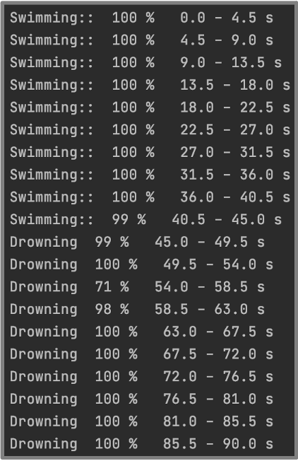
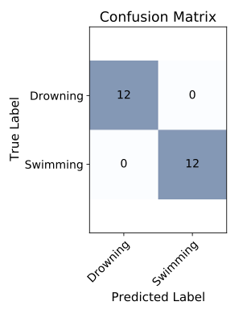

# Anti Drowning Detection Algorithm

Recently, the frequency of drowning incidences has been increasing. A study revealed children aged 1-4 and adolescents to be most at risk of death in swimming pools and freshwater respectively in the UK. Current technologies like Poseidon detect, using cameras, when a person has been motionless at the bottom of a pool for 10 seconds, and sends an alarm. Other technologies rely on manual deployment of flotation devices which is unsuitable for children who will panic in a crisis. This repository contains a suite of trained convolutional neural networks (CNNs) to differentiate between swimming strokes and drowning (flailing) along with our thresholding algorithm to detect sharp instantaneous changes in heart rate. We obtain an accuracy of 97% for our wavelets CNN.


### Prerequisites

Install the following dependencies to your virtual environment:

```
pip install scikit-learn
pip install pywt
pip install tensorflow
pip install keras
```

### Results
 


## Authors

* **Jake Beard** - [GitHub Page](https://github.com/jake-beardo)
* **Vedang Joshi** - [GitHub Page](https://github.com/vedang-joshi)
* **Isobel Russell** - [GitHub Page](https://github.com/isobelrussell00)
* **Will Womersley** - [GitHub Page](https://github.com/WWomersley)
* **Will Tipping** - [GitHub Page](https://github.com/WillTipping)

## License

This project is licensed under the GNU General Public License - see the [LICENSE.md](LICENSE.md) file for details

## Acknowledgments

* A special thanks to [Mark Blyth](https://research-information.bris.ac.uk/en/persons/mark-d-blyth) for guiding us through this project.
